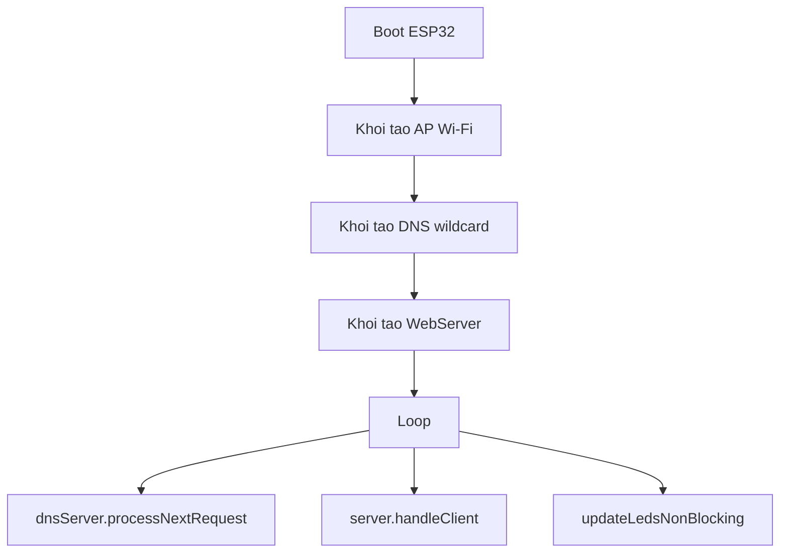

# BAI GIANG IOT: ESP32 Music Reactive LED + Xu ly loi mang

## 1) Muc tieu buoi hoc
- Hieu kien truc co ban cua mot he thong IoT edge voi ESP32.
- Giao tiep AP mode + web local de dieu khien thiet bi.
- Doc va phan tich log reset/assert tren ESP32.
- Sua loi mang lwIP theo huong on dinh va toi uu loop.

## 2) Boi canh du an
- Thiet bi: ESP32 + 2 day LED WS2812B.
- Chuc nang: Tao Wi-Fi AP, mo web tai 192.168.4.1, dieu khien LED.
- Thu vien chinh: WiFi, DNSServer, FastLED, WebServer.

## 3) Loi thuc te gap phai
Thong bao:
- assert failed: tcp_alloc ... (Required to lock TCPIP core functionality!)

Y nghia:
- He thong mang lwIP bi goi TCP API o ngu canh khong an toan (khong lock core).
- Thuong xay ra khi dung ket hop bat dong bo (async) khong tuong thich phien ban core/thu vien.

## 4) Huong sua da ap dung
- Chuyen tu ESPAsyncWebServer sang WebServer dong bo de tranh xung dot lwIP.
- Bat captive portal don gian:
  - DNS tra ve AP IP (192.168.4.1)
  - route notFound chuyen huong ve trang goc
- Kich hoat xu ly lien tuc trong loop:
  - dnsServer.processNextRequest()
  - server.handleClient()
- Toi uu LED theo kieu non-blocking bang millis(), tranh delay dai.

## 5) Tai sao cach nay on dinh hon?
- Kien truc dong bo don gian hon, de kiem soat ngu canh goi mang.
- Vong lap ngan, khong chan, giup Wi-Fi stack duoc "tho" deu.
- Tach ro: xu ly mang, xu ly web, xu ly LED.

## 6) So do luong chay

## 7) Mau checklist debug cho sinh vien
- Kiem tra log reset: rst reason, assert file, line.
- Kiem tra phien ban ESP32 core va thu vien web.
- Loai bo delay lon trong loop.
- Dam bao ham xu ly DNS/Web duoc goi lien tuc.
- Giam do sang/dong dien LED neu reset nguon.

## 8) Bai tap thuc hanh
1. Them route /status tra ve JSON bao gom RSSI, free heap, so client AP.
2. Them route /brightness?value=0..255 de thay doi do sang LED.
3. Them watchdog logic canh bao neu loop bi cham > 200ms.

## 9) Cau hoi thao luan
- Khi nao nen dung async server, khi nao nen dung sync server?
- Vi sao non-blocking la ky thuat quan trong trong IoT firmware?
- Neu muon mo rong cloud, can bo sung gi ve bao mat?

## 10) Tong ket
- Loi tcp_alloc thuong lien quan den ngu canh goi stack mang.
- Cach fix nhanh, ben: chuyen web server dong bo + loop non-blocking.
- Tu du an nho co the mo rong len kien truc IoT day du (edge + cloud + observability).
